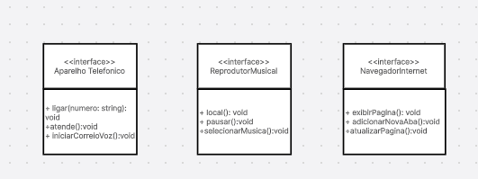
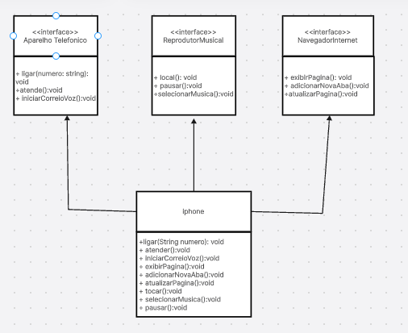

## POO - Desafio

### Modelagem e Diagramação de um Componente iPhone

Neste desafio, você será responsável por modelar e diagramar a representação UML do componente iPhone, abrangendo suas funcionalidades como Reprodutor Musical, Aparelho Telefônico e Navegador na Internet.
### Objetivo
1. Criar um diagrama UML que represente as funcionalidades descritas acima. OK
2. Implementar as classes e interfaces correspondentes em Java (Opcional). OK

## 📊 Diagrama UML

  

## 📊 Diagrama UML Phone

  

## Descrição das Interfaces e Classes

### Aparelho Telefônico (AparelhoTelefonico)

A interface `Aparelho Telefônico` é responsável por implementar a funcionalidade de um telefone. Ela possui métodos como `ligar()`, `atender()`, e `iniciarCorreioVoz()`. A classe `Contato` armazena informações de contatos.

### Reprodutor Musical (ReprodutorMusical)

A interface `Reprodutor Musical` é responsável por implementar a funcionalidade de reprodução de arquivos de áudio. Ela possui métodos como `tocar()`, `pausar()`, e `selecionarMusica()`. A classe `Musica` armazena informações sobre as músicas.

### Navegador de Internet (NavegadorInternet)

A interface `Navegador de Internet` é responsável por implementar a funcionalidade de um navegador web. Ela possui métodos como `exibirPagina()`, `adicionarNovaAba()`, e `atualizarPagina()`.

>"...Jamais DEIXE alguém de limitar, seja seu próprio limite pois assim nunca será limitado!", ( EiJhonatan, 2024).

## FIM